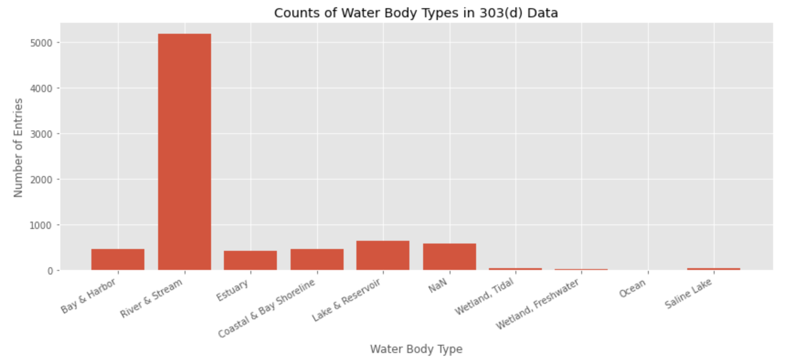

# dammed_river_impairment
# Can We Fix Our Dammed Rivers?

# Background
------

The first dam was built in California in 1770. Today there are over 1,500 dams in California alone and dams across the U.S. are responsible for more than 6% of the country's electric power. They are also responsible for altering the ecosystems they sit on in ways we still don't fully understand. 

In 1992, the EPA started implementing TMDLs to start improving water qualities. 28 years later there are still thousands of impaired water bodies across the state of California.

Three important terms:
- Impaired water bodies: Water bodies that do not meet, or are not expected to meet, water quality standards. A water body is impaired if it contains a certain amount of any pollutant. 
- 303(d) List: A list of all water bodies in California that have are impaired.
- TMDLs: Total Maximum Daily Loads. If a water body is designated to be impaired, the state must calculate the TMDL required to begin raising the water quality.

## Questions
- Do dammed rivers contain more pollutants than naural rivers?
- Are dammed rivers helped by the implementation of TMDLs?

# The Data
---------

## California Dams Data

The California dams data comes from the U.S. Army Corps of Engineers. This dataset consists of 1576 dams in California that meet at least one of the following criteria:
- High hazard potential classification - loss of human life is likely if the dam fails,
- Significant hazard potential classification - no probable loss of human life but can cause economic loss, environmental damage, disruption of lifeline facilities, or impact other concerns,
- Equal or exceed 25 feet in height and exceed 15 acre-feet in storage,
- Equal or exceed 50 acre-feet storage and exceed 6 feet in height.

The dataset documents over 50 different dam attributes, but I will only be using this data to cross reference dammed rivers with impaired rivers in California Impaired Waters Dataset, so the only important column here is, 'RIVER'.

## California 303(d) Impaired Waters Data

In this analysis I only used waterbodies classified as rivers or streams, as that was the only way relate dams with impaired rivers. For a more in depth analysis I would use lat,long locations so I could include reservoirs, lakes, and other waterbodies in my report.

There are three columns in this dataset that will be important to me: 'WATER BODY NAME', 'WATER TYPE', and 'POLLUTANT'. 

The data has 10 different classifications for 'Water Body Type'. While there are many lakes, wetlands, bays, and harbors that recieve dammed tributaries, I don't have enough data to infer every distributary from each dammed river so I will focus my analysis only on water bodies classified as, 'River and Stream'.

# Repeated impaired rivers

One feature of this dataset is that rivers will appear multiple times under different names. I have chosen to keep these as indipendent entities as they refer to different stretches and are subject to different pollutant sources.

# Visualization
-----

## What Percent of California's Impaired Rivers are Dammed?

There are over 1,500 named dams in California, so there aren't many stretches of water that are entirely independent and completely natural. Ideally I would be able to assign each stretch of river in the 303(d) dataset a value as to how far downstream they are from a dam. 

I am not able to do this with the tools at my disposal, so I will be considering all tributaries of dammed rivers to be undammed.

## Do Dammed Rivers Have a Higher Number of Average Pollutants?  

It looks like both dammed and natural rivers display very similar. There are a few outliers with 15-20 pollutants, but most impaired rivers only seem to contain one to three pollutants. A bootstraped plot of the mean number of pollutants shows that both dammed and natural rivers have a mean number of pollutants of around 3.40.

## Do Dammed Rivers and Natural Rivers Suffer From Different Types of Pollutants?

Here we see the fifteen most common pollutants in dammed and natural rivers. Something immediately jumps out:
The three most common pollutants for natural rivers are Fecal Coliform, E. coli, and Diazinon. All these pollutants are the result of things being dumped in rivers that shouldn't be. 

The three most common pollutants for dammed rivers, however, are Sedimentation/Siltation, Unkown Toxicity, and Mercury. These pollutants are all byproducts of stratified reservoirs and cannot be improved by preventing the continual addition of pollutants to our waters.

# Are We Helping Our Dammed Rivers?
-----

## How Dams Change Our Water's Chemistry

When a stratified reservoir 'turns over' as the weather warms, its sediment along with all the pollutants trapped inside it are cycled through the reservoir and discharged downstream. High levels of mercury, toxicity, and sediment are all common pollutants of this cycle. 

## Effects of TMDLs on Dammed Rivers

How much of a river's pollutants can be
To answer this, I took the 15 most common pollutants and grouped them by whether or not they could feasibly be solved by the implementaion of TMDLs. 

A few considerations I observed when classifying pollutants:
- Pesticides and agricultural runoff can be regulated and would benefit from TMDLs
- Pollutants that depend on the water's chemistry or environmental factors are not feasibly solved with TMDLs
- Metals common in industrial waste can be regulated and would benefit from TMDLs
- Metals used for mining aren't feasibly solved with TMDLs
- Human waste products can be regulated and would benefit from TMDLs

Now that we've classified all the most common pollutants in dammed and natural rivers, we can visualize what percentage of rivers that contain these pollutants will benefit from TMDLs: 

# Final Thoughts

- Based on my analysis, there isn't enough evidence to assert that dammed rivers suffer from a greater number of pollutants than natural rivers. 

- After looking into the pollutants themselves and the origins of these pollutants, it appears that dammed rivers are more likely to be impaired by pollutants that cannot be monitored by the current regulations we have in place. The conditions of these water bodies are likely to continue to degrade unless more serious steps are taken to maintain the quality of our waters.

# Credits
----

- My data was collected from the [State of California's 303(d) impaired waters list](https://www.waterboards.ca.gov/centralvalley/water_issues/tmdl/impaired_waters_list/2008_2010_usepa_303dlist/20082010_usepa_aprvd_303dlist.pdf) and the Army Corps of Engineer's [National Inventory of Dams](https://nid.sec.usace.army.mil/ords/f?p=105:1)
- [Title Image](https://owwbeaverlake.org/blog/2018/08/fall-lake-turnover-is-coming/) from the New York Times
- [Stratified Reservoir Diagram](https://owwbeaverlake.org/blog/2018/08/fall-lake-turnover-is-coming/) from Ozarks Water Watch
